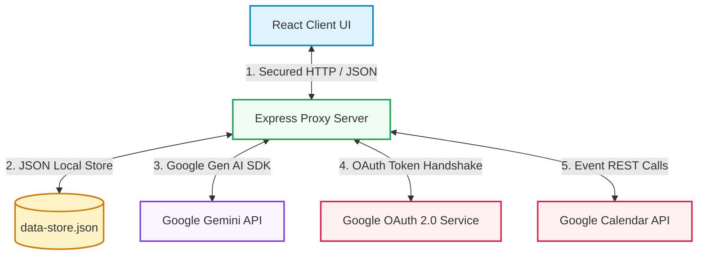
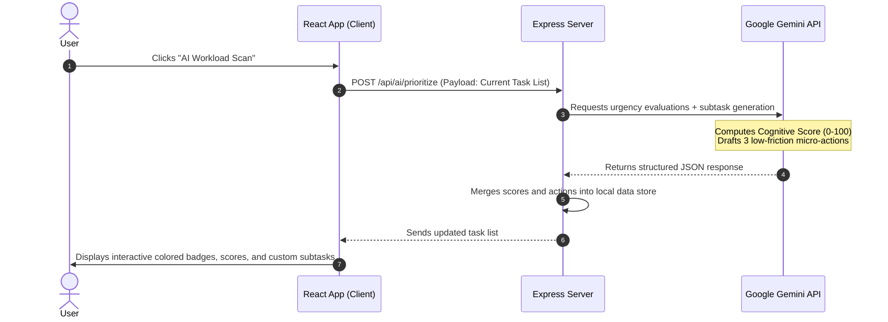

# 🛡️ Clutch — The Right Help at the Right Time
### Complete Technical & Product Specification Document
---

## 📋 Table of Contents
1. [🚨 Problem Statement Selected](#1-problem-statement-selected)
2. [💡 Solution Overview](#2-solution-overview)
3. [✨ Key Features & Capabilities](#3-key-features--capabilities)
4. [🛠️ Technologies Used](#4-technologies-used)
5. [🌐 Google Technologies Utilized](#5-google-technologies-utilized)
6. [📊 System Architecture & Data Flow Diagrams](#6-system-architecture--data-flow-diagrams)
7. [⚙️ Key Workflows & Execution Paths](#7-key-workflows--execution-paths)
8. [🚀 Deployment & Development Guide](#8-deployment--development-guide)

---

## 1. 🚨 Problem Statement Selected

### The Modern Cognitive Crisis: High-Stress Task Procrastination
In today's fast-paced, high-throughput digital environment, professionals, students, and creators face an unprecedented volume of responsibilities. Traditional task managers act as **static dumps**—passive lists of checkboxes that ignore the human element of execution. 

This leads to several critical pain points:
* **Cognitive Overload**: The pure volume of tasks creates paralysis. Users are unable to objectively estimate the effort required, leading to a high-stress "panic cycle" as deadlines approach.
* **Procrastination Hurdles**: The transition from planning to starting is incredibly high friction. Without micro-steps or targeted action suggestions, users default to avoiding high-urgency tasks.
* **Burnout & Inefficient Scheduling**: Conventional calendars squeeze meetings back-to-back without accounting for physical and cognitive recovery buffers, causing rapid fatigue.
* **Lack of Historical Progress**: Users rarely feel a sense of milestone momentum because their accomplishments disappear instantly without contextual or time-stamped history.

### The Objective
To build an active, intelligent, full-stack productivity companion that acts as an **on-demand stress shield**, using predictive scoring, conversational cognitive therapy, and adaptive recovery scheduling to deliver **the right help at the right time**.

---

## 2. 💡 Solution Overview

**Clutch** is a beautifully designed, full-stack, AI-powered productivity system that transforms task management from a passive registry to a **proactive, empathetic guide**. Instead of just showing *what* is due, Clutch calculates *how* it affects your cognitive budget, schedules *when* you should do it (safeguarded by recovery buffers), and coaches you on *how* to begin.

### Core Architecture Concept
By pairing a secure, full-stack **Express + Node.js server** with a responsive **React (Vite) frontend**, Clutch guarantees that secure API secrets, Google OAuth tokens, and Google Gemini API keys are completely protected server-side, while providing a fast, smooth, desktop-grade user experience in the browser.

```
┌────────────────────────────────────────────────────────────────────────┐
│                              CLUTCH SYSTEM                             │
├───────────────────────────────┬────────────────────────────────────────┤
│     PREDICTIVE SCHEDULING     │          COGNITIVE ANALYTICS           │
│  Intelligent Day-Planner &    │      Real-Time focus budget &          │
│   Google Calendar Sync        │       Urgency Indexing Charts          │
├───────────────────────────────┼────────────────────────────────────────┤
│      ACTIVE EMPOWERMENT       │          STRESS SHIELD ENGINE          │
│   Voice-Supported Deadline    │        Repeatable Micro-Habit          │
│  Coach & Low-Friction Steps   │       Streak Trackers & Logs           │
└───────────────────────────────┴────────────────────────────────────────┘
```

---

## 3. ✨ Key Features & Capabilities

### 🧠 1. Real-Time Cognitive Load Analytics
* **Recharts Focus Budgeting**: Interactive, fluid visualization charts representing the user's workload distribution.
* **Dual-Metrics Pivot**: Instantly switch between viewing cognitive load based on **Time Allocation (Hours)** or **Task Count** to identify bottlenecks.
* **Dynamic Hover/Focus States**: Built with responsive SVG triggers for clear information disclosure.

### 🚨 2. AI-Driven Urgency Indexing & Priority Badges
* **Color-Coded Badges**: Dynamic status tags highlighting task priority levels:
  * <span style="color:#ef4444">🔴 **High Priority**</span>: Crimson Red with subtle glowing borders.
  * <span style="color:#f59e0b">🟡 **Medium Priority**</span>: Warm Amber suggesting active focus.
  * <span style="color:#3b82f6">🔵 **Low Priority**</span>: Soft Slate Blue for low-stress tasks.
* **Urgency Scorer (0-100)**: Server-side Gemini models compute real-time stress scores based on hours remaining, task complexity, and category dependencies.
* **Low-Friction Action Steps**: Proactively offers 3 bulleted micro-tasks per deadline to bypass task-start inertia.

### 📅 3. Intelligent AI Day-Planner
* **Recovery-Buffered Agenda**: Generates an optimized, hour-by-hour calendar schedule. Unlike regular calendars, it automatically interleaves 15-30 minute **Recovery Buffers** to protect mental stamina.
* **Google Calendar Synchronization**: Links schedules directly to real-world commitments via Google OAuth to highlight potential scheduling deadlocks.

### 💬 4. Conversational AI Deadline Coach
* **Secure Gemini Chatbot**: Fully integrated conversational agent capable of summarizing workloads, scheduling meetings, and walking users through high-anxiety projects.
* **Acoustic & Voice Integration**: Includes high-fidelity microphone dictation (Web Speech API) and speech synthesis response so users can literally talk through their stress hands-free.

### 🛡️ 5. Daily Stress Shield Habits
* **Micro-Habit Logging**: Tracks repeatable foundational health metrics (Hydration, Screen Break, Mindful Breathing) that act as an armor against work exhaustion.
* **Interactive Streak Engine**: Visual feedback loops with animated fire indicators celebrating consecutive focus streaks.

### 🗳️ 6. Multi-Select & Batch Task Actions
* **Interactive Selection Slate**: Seamlessly select multiple task cards in one click.
* **Unified Batch Controls**: Instantly perform bulk operations such as **Batch Complete**, **Batch Reactivate**, or **Batch Delete** with high-contrast safety confirmation dialogues.

### 🌓 7. Premium Framer Motion Theme Engine
* **Fluid Transition Toggle**: Seamless transition animation for the dark-mode switch. Includes spring-based rotation, scales, and translate slide-outs for the Moon and Sun icons to deliver a high-end interface feel.

---

## 4. 🛠️ Technologies Used

### Frontend Client
* **React 18 & TypeScript**: Core engine ensuring rigorous type safety and reactive layout renderings.
* **Vite**: Ultra-fast next-generation build toolchain.
* **Tailwind CSS v4.0**: Premium utility-first CSS layout structuring, leveraging modern custom theme configurations.
* **Framer Motion**: Advanced physics-based spring animations for page transitions, item expansions, and custom icon morphing.
* **Recharts**: D3-backed responsive data visualizations.
* **Lucide React**: Clean, modern, vector-based interface iconography.

### Backend Server
* **Node.js & Express**: High-speed routing controller and API proxy framework.
* **TypeScript (tsx & esbuild)**: Native type validation and bundling system compiling everything down to a high-density, low-latency `dist/server.cjs` file.

---

## 5. 🌐 Google Technologies Utilized

Clutch relies heavily on Google’s premium developer ecosystem to implement its AI and synchronization capabilities:

| Google Technology | Purpose in Clutch | Implementation Details |
| :--- | :--- | :--- |
| **Google Gemini API** | Deep core cognitive intelligence, planning, and task restructuring. | Leverages Gemini 2.5 Flash for ultra-low latency response cycles. |
| **Google Gen AI SDK (`@google/genai`)** | Primary SDK for interacting with Gemini server-side. | Safe execution pattern that prevents leakage of sensitive developer API tokens. |
| **Google Calendar API** | Keeps schedules synchronized with real-world events. | Reads and writes events, ensuring seamless agenda coordination. |
| **Google OAuth 2.0** | Secure credentials delegation. | Authorizes application scopes with full iframe-safe callback redirection support. |
| **Google Cloud Run** | Host-platform infrastructure. | Provides scalable, containerized execution behind a secure reverse proxy. |

---

## 6. 📊 System Architecture & Data Flow Diagrams

### High-Level Data Flow Architecture
The following diagram illustrates how user actions, local file storage, and external Google APIs connect securely:



### Urgent Prioritization & Action Generation Sequence
This sequence details how a user's task list is converted into custom, low-friction priority plans:



---

## 7. ⚙️ Key Workflows & Execution Paths

### Workflow A: Intelligent AI Day-Planner
1. **Input Generation**: The user defines an active window (e.g., `09:00` to `17:00`) and hits "Generate AI Itinerary".
2. **Context Compilation**: The Express server queries the local file store for all incomplete tasks alongside synchronized Google Calendar events.
3. **Gemini Consultation**: A specialized prompt is compiled containing the strict timeline boundaries.
4. **Intelligent Interleaving**: Gemini returns a time-blocked timeline, ensuring that a **15 to 30-minute Rest / Breathing Buffer** is scheduled after every high-intensity work block.
5. **Real-time Projection**: The frontend renders this itinerary in an elegant, modern timeline widget featuring status checkmarks and sync buttons.

### Workflow B: Frame-Permission Google OAuth Sync
Since the application runs inside an interactive, sandboxed `iframe`, standard browser popup authentication is blocked. Clutch bypasses this using a highly robust redirect pattern:
1. **Initiate Hook**: The user clicks "Link Google Calendar".
2. **Redirect Generation**: The client requests an authorized OAuth redirection URI from the Express server.
3. **Redirection Escape**: The frontend escapes the iframe boundary safely, navigating the user to the secure Google Sign-In interface.
4. **Token Exchange**: Upon completion, Google redirects the user back to the application’s `/api/oauth/callback` router.
5. **Secure Storage**: The server extracts and encrypts the OAuth tokens, caching them safely in a server-side storage session to initiate seamless background calendar syncing.

### Workflow C: Multi-Select Task Batch Execution
Designed to drastically reduce administrative overhead for highly busy users:
1. **State Pivot**: The user taps "Select Multiple" on their deadline panel. This mounts Framer Motion selection checkboxes to each individual task card.
2. **Dynamic Collection**: Selected task IDs are tracked inside a local React array state, updating color highlight outlines on the fly.
3. **Action Dispatch**: The user performs a batch action (e.g., bulk "Mark Completed" or "Delete").
4. **Optimistic UI Execution**: The client updates local view lists instantly, keeping the UI highly responsive.
5. **Server Synchronization**: A single, optimized `POST /api/tasks/batch` request is sent to the Express backend to update all targeted databases simultaneously.

---

## 8. 🚀 Deployment & Development Guide

### Local Setup Instructions
1. Clone the repository and navigate into the project directory.
2. Ensure you have Node.js (v18+) installed.
3. Create a `.env` file based on `.env.example`:
   ```env
   GEMINI_API_KEY=AIzaSy...YourAPIKeyHere
   GOOGLE_CLIENT_ID=your_client_id.apps.googleusercontent.com
   GOOGLE_CLIENT_SECRET=GOCSPX-your_client_secret
   ```
4. Run `npm install` to set up all required full-stack dependencies.
5. Execute `npm run dev` to boot up the Express server coupled with the Vite compiler on `http://localhost:3000`.

### High-Performance Production Builds
Clutch uses an advanced **esbuild** bundling mechanism to compile backend TypeScript files cleanly, avoiding common runtime ES Module resolution errors in Node.js:
* Run the build command:
  ```bash
  npm run build
  ```
  This command performs a dual operation:
  1. Compiles and packages client-side React assets into optimized static builds inside `/dist`.
  2. Bundles the custom backend server `server.ts` into a self-contained, optimized file: `dist/server.cjs`.
* Start the production-ready server instantly:
  ```bash
  npm run start
  ```
  The compiled application runs reliably on port `3000` with near-instant cold-start metrics.

---
*Created with care by the **Clutch Developer Team**. Harnessing the power of Google Cloud and Gemini AI to defend your mental focus and cognitive stamina.*
